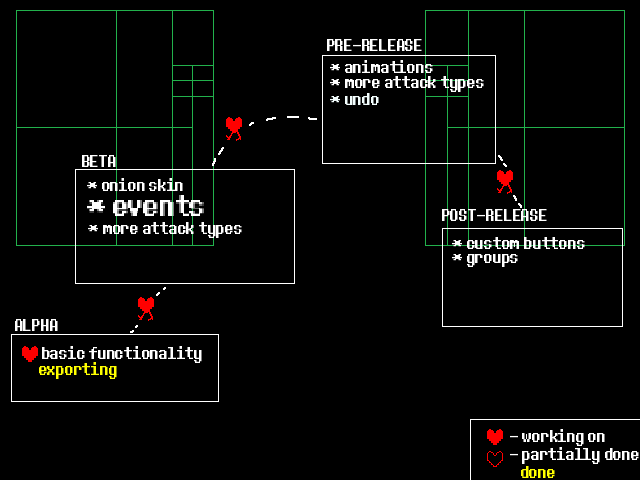

  

#

# 
 CATAK - Create your firsk Attack helper 
 </h1>

## **About**
  CATAK is a Create your frisk visual attack helper written in pure C using [RAYLIB](raylib.com), written to make editing attacks much easier.    
 More here later !!!
#

## 
 ROADMAP 

  

- note that not all future features are listed (yettm)

scaled {
    font-size: 100;
}